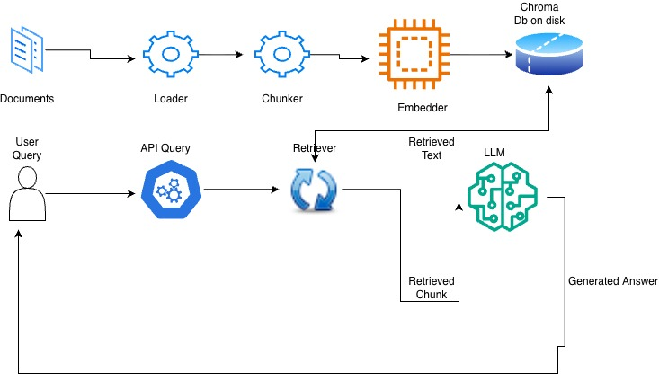

# Design Document — Mutual Fund Factsheet RAG Service

## 1. Problem and Scope

We are building a service for querying mutual fund factsheets. Going through
these documents manually takes hours, and clients find it hard to read every
page. Instead, they can ask our chatbot a question and get a grounded answer
pulled directly from a pre-loaded factsheet.

**Out of Scope (planned for future versions):**
- Querying multiple documents together (the corpus is a single pre-loaded factsheet for now).
- Image / chart understanding inside the PDFs.
- User-uploaded documents at query time (the corpus is ingested at startup from a fixed source).

## 2. High Level Design (HLD)

Two separate flows meet at the vector store:

**Ingestion flow (runs once, at startup):**
```
Documents → Loader → Chunker → Embedder → Chroma DB (on disk)
```

**Query flow (per request):**
```
User Query → API → Retriever → Chroma DB → (retrieved chunks) → LLM → Grounded Answer
```

The Retriever reads from the same Chroma store that ingestion wrote to. Ingestion
and query are decoupled: documents are embedded once and persisted, so query-time
never re-embeds the corpus.



## 3. Low Level Design (LLD)

- **`loader.load_document(path: str) -> str`**
  Takes a document path and returns its contents as plain text. Currently supports
  PDF and text files. Always returns a single `str` regardless of input format, so
  downstream steps never branch on file type.

- **`chunker.chunk_text(text: str, chunk_size, overlap) -> list[str]`**
  Splits the text into a list of chunks. `chunk_size` sets how large each chunk is;
  `overlap` repeats a slice of the previous chunk at the start of the next, so
  information straddling a boundary is not lost.

- **`embedder.embed_texts(texts: list[str]) -> list[list[float]]`**
  Takes a list of text chunks and returns one vector per chunk. Converts text into
  vector format so we can store it and run semantic search. Uses OpenAI's
  `text-embedding-3-small` model. Batches internally to stay under the API's
  per-request token limit.

- **`VectorStore.add(texts, metadata) -> None`**
  Takes text chunks (and optional metadata), embeds them internally, and stores the
  text + vector + metadata together in the on-disk Chroma DB.

- **`VectorStore.search(query: str, top_k) -> list[str]`**
  Embeds the user query, runs semantic search against the stored corpus, and returns
  the `top_k` most similar text chunks. Vectors are an internal detail — the method
  takes text and returns text.

- **`generator.generate_answer(query, context_chunks) -> str`**
  Takes the user query and the retrieved context chunks, and returns a grounded
  answer built only from those chunks. Uses OpenAI's `gpt-4o-mini` model.

## 4. Key Design Decisions

- **ChromaDB now, pgvector later.** Chroma persists to disk with almost no infra
  setup, which lets us learn and ship the persistence pattern without standing up a
  database. pgvector is the planned upgrade — it adds schema/relational design and
  scales better — but it carries setup cost we deliberately deferred out of v1. All
  vector-store logic sits behind the `VectorStore` interface, so the swap is a
  one-file change.

- **Embed once, persist to disk.** Re-embedding the corpus on every startup wastes
  time and API spend. We compute vectors once, persist them, and load them on
  subsequent starts — which makes startup near-instant and keeps query latency low.

- **Startup-time ingestion (lifespan).** Ingestion runs once when the service boots,
  not per request, guarded by a check that skips ingestion if the store is already
  populated. This is why a restart with a populated store costs milliseconds instead
  of re-embedding everything.

- **Loader returns a single type.** Every branch of the loader returns plain `str`,
  so the messiness of "PDF vs txt" is contained at the boundary and no downstream
  function has to handle multiple input shapes.

- **Grounded prompt.** The generation prompt instructs the LLM to answer only from
  the provided context and to say "I don't have enough information" otherwise. This
  prevents it from answering from pretrained knowledge, which would defeat the
  purpose of RAG.

- **Swappable model provider.** The system uses OpenAI now
  (`text-embedding-3-small` for embeddings, `gpt-4o-mini` for generation) but is
  structured so the provider can later be swapped for Bedrock or an open-source model
  without touching application code.

## 5. Known Gaps & Next Steps

- **Naive top-k retrieval.** The retriever returns the top 3 nearest chunks across
  the whole corpus with no filtering or re-ranking. Because a factsheet contains many
  funds with near-identical "expense ratio" sections, this can return the wrong
  fund's numbers and give inconsistent answers across runs. **Fix (next version):**
  metadata filtering (restrict search to the relevant fund) + re-ranking. This is an
  accuracy problem, not a cost problem.

- **No metadata filtering yet.** The store supports metadata, but retrieval does not
  yet use it to scope queries. Adding it is the main lever for the accuracy gap above.

- **Tests hit the live API.** `pytest` currently makes real OpenAI calls, which is
  slow and costs a few cents per run. **Fix (later version):** mock the API boundary
  so tests are fast, free, and deterministic — we test our own code's behavior, not
  OpenAI's.